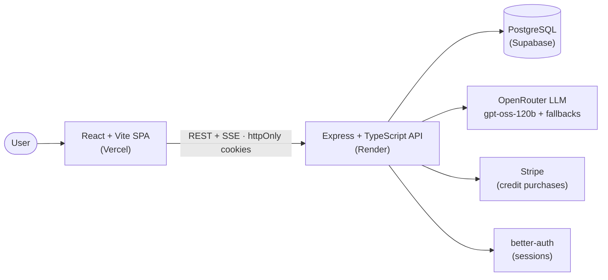
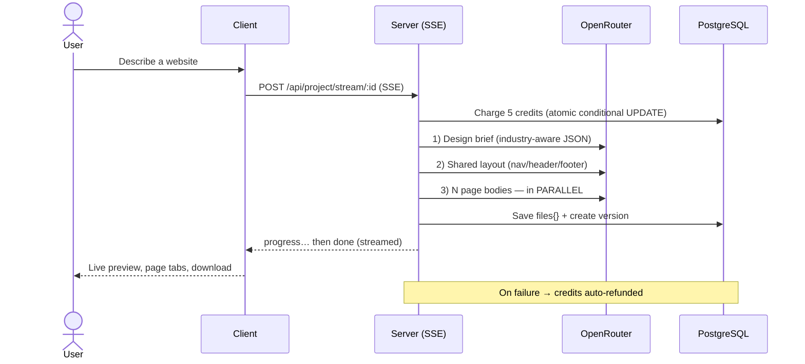

<div align="center">

# 🌐 GenSite — AI Website Builder

**Turn a single sentence into a complete, responsive, multi-page website — in seconds, with AI.**

[](https://react.dev)
[](https://www.typescriptlang.org)
[](https://expressjs.com)
[](https://www.prisma.io)
[](https://supabase.com)
[](https://tailwindcss.com)

[**Live Demo →**](https://ai-website-builder-prathamesh-three-amber.vercel.app)

</div>

---

## ✨ What is it?

**GenSite** is a full-stack **generative-AI** web app that lets anyone build a website by *describing it in plain English*. Type something like *"a sleek landing page for a coffee brand with a menu and a contact section,"* and GenSite designs, generates, and publishes a complete, responsive **multi-page** site — no code, no design tools, no templates.

It's a real product, not a demo: authentication, credit-based billing, live previews, version history, an in-browser element editor, and one-click publishing to a public community gallery.

## 🎯 The problem it solves

Getting a website online still has a painfully high barrier to entry — non-technical people can't write HTML/CSS, agencies are slow and expensive, and drag-and-drop builders still demand hours of manual layout. GenSite collapses *"I have an idea"* → *"my site is live"* into a single sentence and a few seconds by putting an LLM in the generation loop.

## 🚀 Features

- 🧠 **Prompt-to-website generation** — describe it, get a full standalone HTML + Tailwind site
- 📄 **Multi-page sites** — a design brief drives several pages built in parallel, sharing one consistent layout and navigation
- 🎛️ **Model picker** — choose a specific AI model or let *Auto* spread work across free models
- 💬 **Conversational revisions** — refine any page with natural-language follow-ups
- 🖱️ **In-place element editing** — click any section in the preview and edit just that piece
- 🕑 **Version history** — every change is versioned; roll back anytime
- 👀 **Live streaming preview** — watch the site build over SSE, rendered in a sandboxed iframe
- 🌍 **Publish to community** — share your site on a public gallery with a shareable URL
- ⬇️ **Download** — export the whole multi-page site as a ZIP
- 🔐 **Authentication** — email/password auth with secure, cross-domain sessions
- 💳 **Credit system + Stripe billing** — atomic, race-safe metering with paid top-ups

## 🏗️ Architecture



### Multi-page generation pipeline



## 🧰 Tech stack

| Layer | Technology |
| --- | --- |
| **Frontend** | React 19, Vite 7, TypeScript, Tailwind CSS 4, React Router 7, Axios, Sonner, Framer Motion |
| **Backend** | Node.js (≥ 20), Express 5, TypeScript, Zod, Helmet |
| **Database** | PostgreSQL (Supabase) + Prisma 7 (`@prisma/adapter-pg`) |
| **Auth** | better-auth (email/password, httpOnly cookie sessions) |
| **AI** | OpenRouter (OpenAI-compatible SDK) — `openai/gpt-oss-120b:free` + fallback chain |
| **Payments** | Stripe (Checkout + signed webhooks) |
| **Testing / CI** | Vitest · GitHub Actions (typecheck · build · test) |
| **Hosting** | Vercel (client) · Render (API) · Supabase (DB) |

## 🧱 Clean, layered architecture

The codebase is organized into **feature modules** with clear separation of concerns.

**Server** — each domain is a vertical slice; controllers are thin and never touch the database:

```
routes → controller (HTTP) → service (business rules) → repository (Prisma) → schema (Zod)
```

```
server/
├── app.ts · server.ts          # app assembly (helmet/CORS/CSRF/routers/errors) + bootstrap
├── modules/
│   ├── project/                # crud · generation (SSE) · revisions · element edits
│   ├── user/                   # credits, projects, publish, catalogs
│   └── billing/                # Stripe checkout + webhook
└── shared/
    ├── config/                 # constants (credit costs, limits) — no magic numbers
    ├── http/                   # AppError · central errorHandler · asyncHandler · validate
    ├── middleware/             # auth · rate limiters
    └── lib/                    # framework-agnostic: generate, prompts, openai, storage…
```

**Client** — feature-based, `@/…` alias imports:

```
client/src/
├── app/                        # App, providers, routing
├── pages/                      # route screens (Home, Pricing, Community, Legal…)
├── features/                   # auth · editor · billing
└── shared/                     # ui · components · lib · api
```

## 🛠️ Engineering highlights & design decisions

The interesting parts are the trade-offs, not the happy path:

- **Two-step multi-page generation.** A JSON *design brief* picks the pages and identity, then a **shared layout** is generated once and **N page bodies are built in parallel**, round-robined across free models — so every page shares byte-identical chrome/nav. Falls back to single-page if the brief step fails. (`server/shared/lib/generate.ts`)
- **Atomic, race-safe credit metering.** Credits are charged with a single conditional `UPDATE ... WHERE credits >= amount`, so concurrent requests can't overspend. The **authoritative charge happens at generation time** (not project creation), and refunds only ever reverse a charge that actually happened — a failed build is refunded and never silently re-run for free.
- **Resilient AI layer.** Free LLM endpoints are rate-limited and frequently deprecated, so every call **retries transient `429`s and falls back across an ordered list of free models**. The active models live in one place and are overridable by env.
- **Streaming generation over SSE.** The client reads the build off `fetch` (not `EventSource`), with an in-flight guard + cancel via a per-process `AbortController` map, and a per-project edit lock so two writers can't race the "current version."
- **Untrusted AI HTML is sandboxed.** Public/community/preview views render generated HTML in a `sandbox="allow-scripts"` iframe (no `allow-same-origin`) so AI output can't touch the host app or its cookies.
- **Idempotent Stripe billing.** Credits are granted from the **signature-verified webhook**, keyed by the unique `stripeSessionId`; refunds/disputes claw credits back exactly once, all inside DB transactions.
- **Security by default.** Helmet headers, a CORS + Origin-based CSRF check driven by a trusted-origins allowlist, tiered rate limiters, a bounded JSON body, and a `/healthz` probe that also reports DB reachability.
- **Connection pooling.** Runtime traffic uses Supabase's **transaction pooler (PgBouncer)**; migrations use a **direct connection** — avoiding connection exhaustion.

## ⚡ Getting started

### Prerequisites
- **Node.js ≥ 20**
- A PostgreSQL database (e.g. a free [Supabase](https://supabase.com) project)
- An [OpenRouter](https://openrouter.ai) API key (free tier works)
- A [Stripe](https://stripe.com) account (test mode) — optional, for billing

### 1. Clone
```bash
git clone https://github.com/Prathamesh51-debug/AiWebsiteBuilder.git
cd AiWebsiteBuilder
```

### 2. Backend
```bash
cd server
npm install
cp .env.example .env            # then fill in the values (see below)
npx prisma migrate deploy       # apply schema to your DB
npm run dev                     # API on http://localhost:3000
```

### 3. Frontend
```bash
cd client
npm install
cp .env.example .env            # set VITE_BASEURL
npm run dev                     # app on http://localhost:5173
```

## 🔑 Environment variables

**`server/.env`** (see `server/.env.example`)

| Variable | Description |
| --- | --- |
| `DATABASE_URL` | PostgreSQL connection — Supabase **transaction pooler** (port 6543, `?pgbouncer=true`) |
| `DIRECT_URL` | Direct DB connection — used **only** by Prisma migrations |
| `BETTER_AUTH_SECRET` | Random secret for signing sessions |
| `BETTER_AUTH_URL` | The API's public base URL |
| `TRUSTED_ORIGINS` | Comma-separated allowed origins (your frontend URL) — drives CORS **and** the CSRF check |
| `AI_API_KEY` | OpenRouter API key |
| `GEN_MODELS` / `GEN_MODEL` / `EDIT_MODEL` | _(optional)_ override the model list / defaults |
| `STRIPE_SECRET_KEY` · `STRIPE_WEBHOOK_SECRET` | Stripe keys (billing) |
| `RESEND_API_KEY` · `EMAIL_FROM` | _(optional)_ enable verification emails; unset ⇒ links logged to console |
| `STORAGE_DRIVER` | _(optional)_ `inline` (default, Postgres) or `s3` — see `server/SCALING.md` |
| `NODE_ENV` / `PORT` | environment / listen port (injected by most hosts) |

**`client/.env`** (see `client/.env.example`)

| Variable | Description |
| --- | --- |
| `VITE_BASEURL` | Backend API base URL (e.g. `http://localhost:3000`) — baked in at **build time** |

## 🧪 Scripts & testing

```bash
# server
npm run dev        # tsx watch
npm run build      # prisma generate && tsc
npm start          # node dist/server.js
npm test           # Vitest (pure-function tests under shared/lib/__tests__)
npx tsc --noEmit   # typecheck

# client
npm run dev        # Vite dev server
npm run build      # production build
npm run lint       # ESLint
npx tsc --noEmit -p tsconfig.app.json
```

CI (`.github/workflows/ci.yml`) runs typecheck + build for both apps and the server test suite on every push/PR.

## 🚢 Deployment

| Piece | Platform | Notes |
| --- | --- | --- |
| **Client** | Vercel | Root = `client`. Set `VITE_BASEURL` to the API URL. `vercel.json` handles SPA routing. |
| **API** | Render | Build: `npm run build`. Start: `npm start`. Set `TRUSTED_ORIGINS` to the client URL. |
| **Database** | Supabase | Transaction pooler for `DATABASE_URL`; run `prisma migrate deploy` against `DIRECT_URL`. |

Subscribe the Stripe webhook to `checkout.session.completed`, `payment_intent.succeeded`, `charge.refunded`, and `charge.dispute.funds_withdrawn`.

> 💡 The demo API runs on a free Render tier and **sleeps after inactivity** — the first request may take ~30–60s to cold-start.

## 🔒 Privacy & Terms

The app ships with in-product legal pages, served by the SPA:

- **Privacy Policy** → `/privacy`
- **Terms of Service** → `/terms`

These describe what data is stored (account, projects, billing records via Stripe) and the acceptable-use terms for generated sites. Update the copy in `client/src/pages/Privacy.tsx` and `client/src/pages/Terms.tsx` to match your deployment before going live.

## 🗺️ Roadmap

- [ ] **Agentic generation** — a tool-calling agent that *plans → generates → validates → self-corrects* in a loop
- [ ] Multi-node scaling — move the in-flight/edit locks to Redis (see `server/SCALING.md`)
- [ ] Custom-domain publishing
- [ ] AI image generation / real asset sourcing instead of placeholders
- [ ] Usage analytics and observability dashboards

## 👤 Author

**Prathamesh** · [GitHub](https://github.com/Prathamesh51-debug)

## 📄 License

Released under the MIT License.
