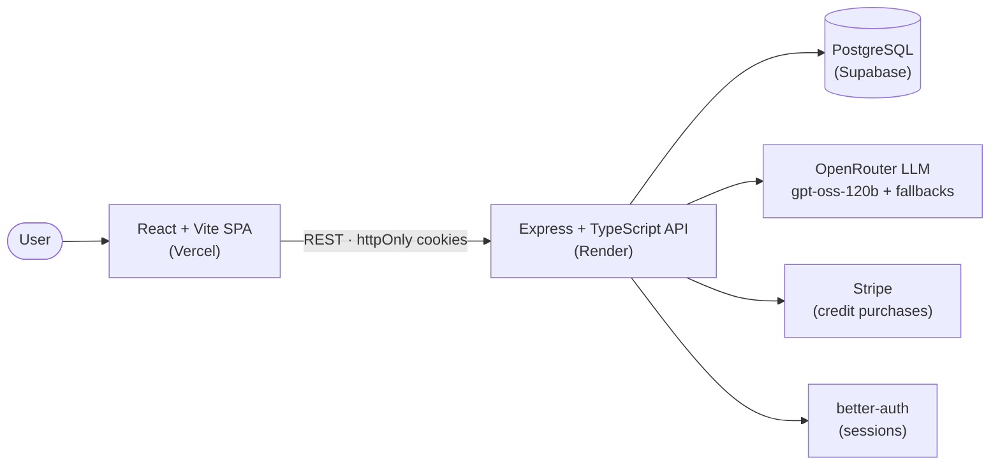
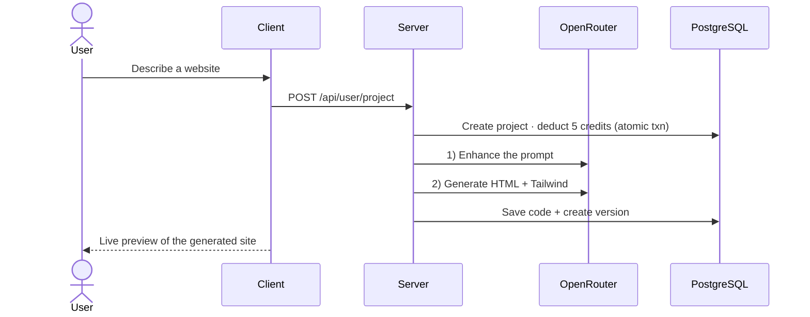

<div align="center">

# 🌐 SiteBuilder — AI Website Builder

**Turn a single sentence into a complete, responsive, publishable website — in seconds, with AI.**

[](https://react.dev)
[](https://www.typescriptlang.org)
[](https://expressjs.com)
[](https://www.prisma.io)
[](https://supabase.com)
[](https://tailwindcss.com)

[**Live Demo →**](https://ai-website-builder-prathamesh-three-amber.vercel.app)

</div>

---

## ✨ What is it?

**SiteBuilder** is a full-stack **Generative AI** web application that lets anyone build a website by simply *describing it in plain English*. You type something like *"a sleek landing page for a coffee brand with a menu and contact section,"* and the app uses a large language model to design, generate, and publish a complete, responsive website — no code, no design tools, no templates.

It's a complete product, not a demo: authentication, a credit-based billing system, live previews, version history, and one-click publishing to a public community gallery.

## 🎯 The problem it solves

Getting a website online still has a painfully high barrier to entry:

- **Non-technical people** (small-business owners, freelancers, creators) can't write HTML/CSS or wire up a deploy.
- **Agencies and freelancers** are expensive and slow (days-to-weeks, hundreds of dollars).
- **Drag-and-drop builders** still demand hours of manual layout work and design decisions.

SiteBuilder collapses *"I have an idea"* → *"my site is live"* into a single sentence and a few seconds. It democratizes web creation the same way no-code tools tried to — but removes the manual work entirely by putting an LLM in the generation loop.

## 🚀 Features

- 🧠 **Prompt-to-website generation** — describe it, get a full standalone HTML + Tailwind site
- 💬 **Conversational revisions** — refine any detail with natural-language follow-ups
- 🕑 **Version history** — every generation is versioned; roll back anytime
- 👀 **Live in-app preview** — sandboxed iframe rendering of the generated site
- 🌍 **Publish to community** — share your site with a public, shareable URL
- 🔐 **Authentication** — email/password auth with secure, cross-domain sessions
- 💳 **Credit system + Stripe billing** — metered usage with paid top-up plans
- 🎨 **Polished, responsive UI** — dark glassmorphic design, animations, mobile-first

## 🖼️ Demo

| Landing | Generation | Community |
| --- | --- | --- |
| Describe your idea | AI builds & previews | Explore public sites |

> 💡 The live backend runs on a free Render tier and **sleeps after inactivity** — the first request may take ~30–60s to cold-start.

## 🏗️ Architecture



### Generation pipeline



## 🧰 Tech stack

| Layer | Technology |
| --- | --- |
| **Frontend** | React 19, Vite 7, TypeScript, Tailwind CSS 4, React Router 7, Axios, Sonner |
| **Backend** | Node.js, Express 5, TypeScript |
| **Database** | PostgreSQL (Supabase) + Prisma 7 ORM (`@prisma/adapter-pg`) |
| **Auth** | better-auth (email/password, httpOnly cookie sessions) |
| **AI** | OpenRouter (OpenAI-compatible SDK) — `openai/gpt-oss-120b:free` + fallback chain |
| **Payments** | Stripe (Checkout + webhooks) |
| **Hosting** | Vercel (client) · Render (API) · Supabase (DB) |

## 🛠️ Engineering highlights & design decisions

The interesting parts aren't the happy path — they're the trade-offs:

- **Resilient AI layer.** Free LLM endpoints are rate-limited and frequently swapped/deprecated. The AI client ([`server/configs/openai.ts`](server/configs/openai.ts)) wraps every call in a helper that **retries transient `429`s and then falls back across an ordered list of free models**, so a single throttled provider doesn't take down generation. The active model is configured in **one place**.
- **Atomic credit metering.** Credits are decremented inside a Prisma `$transaction`, and refunded automatically if generation fails — so users are never charged for a failed build.
- **Cross-domain auth done right.** Client (Vercel) and API (Render) live on different domains, so sessions use `httpOnly` cookies with `SameSite=None; Secure` in production and CORS scoped to a trusted-origins allowlist.
- **Connection pooling for serverless-style hosting.** The app connects through Supabase's **transaction pooler (PgBouncer)** for runtime and a **direct connection only for migrations** — avoiding connection exhaustion under load.
- **Sandboxed previews.** Generated sites are rendered in a sandboxed `<iframe srcDoc>` so untrusted, AI-generated HTML/JS can't touch the host app.
- **Stripe webhook fulfillment.** Credits are granted from the verified `checkout.session.completed` webhook (raw-body verified), not the client redirect — the source of truth is the server.

## 📁 Project structure

```
.
├── client/                 # React + Vite frontend (deployed to Vercel)
│   ├── src/
│   │   ├── pages/          # Home, Pricing, Community, My Projects, Auth, Preview…
│   │   ├── components/     # Navbar, Footer, EditorPanel, Sidebar…
│   │   ├── configs/        # axios instance
│   │   └── lib/            # better-auth client, utils
│   └── vercel.json         # SPA rewrite to index.html
│
└── server/                 # Express + TypeScript API (deployed to Render)
    ├── controllers/        # project + user + stripe webhook logic
    ├── routes/             # /api/user, /api/project
    ├── middlewares/        # auth (protect)
    ├── lib/                # prisma client, better-auth config
    ├── configs/            # OpenRouter AI client + fallback helper
    └── prisma/             # schema + migrations
```

## ⚡ Getting started

### Prerequisites
- Node.js ≥ 18
- A PostgreSQL database (e.g. a free [Supabase](https://supabase.com) project)
- An [OpenRouter](https://openrouter.ai) API key (free tier works)
- A [Stripe](https://stripe.com) account (test mode) — optional, for billing

### 1. Clone
```bash
git clone https://github.com/Prathamesh51-debug/AiWebsiteBuilder.git
cd AiWebsiteBuilder
```

### 2. Backend
```bash
cd server
npm install
# create server/.env (see below), then:
npx prisma migrate deploy   # apply schema to your DB
npm run dev                 # starts API on http://localhost:3000
```

### 3. Frontend
```bash
cd client
npm install
# create client/.env (see below), then:
npm run dev                 # starts app on http://localhost:5173
```

## 🔑 Environment variables

**`server/.env`**

| Variable | Description |
| --- | --- |
| `DATABASE_URL` | PostgreSQL connection (Supabase **transaction pooler**, port 6543, `?pgbouncer=true`) |
| `DIRECT_URL` | Direct DB connection — used **only** by Prisma migrations |
| `BETTER_AUTH_SECRET` | Random secret for signing sessions |
| `BETTER_AUTH_URL` | The API's public base URL |
| `TRUSTED_ORIGINS` | Comma-separated allowed origins (your frontend URL) |
| `AI_API_KEY` | OpenRouter API key |
| `STRIPE_SECRET_KEY` | Stripe secret key |
| `STRIPE_WEBHOOK_SECRET` | Stripe webhook signing secret |
| `NODE_ENV` | `development` or `production` |

**`client/.env`**

| Variable | Description |
| --- | --- |
| `VITE_BASEURL` | The backend API base URL (e.g. `http://localhost:3000`) |

> ⚠️ `VITE_*` values are baked in at **build time** — set `VITE_BASEURL` to your deployed API URL before deploying the frontend.

## 🚢 Deployment

| Piece | Platform | Notes |
| --- | --- | --- |
| **Client** | Vercel | Root directory = `client`. Set `VITE_BASEURL` to the API URL. `vercel.json` handles SPA routing. |
| **API** | Render | Build: `npm run build` (runs `prisma generate && tsc`). Start: `npm start`. |
| **Database** | Supabase | Use the transaction pooler for `DATABASE_URL`; run `prisma migrate deploy` against `DIRECT_URL`. |

## 🗺️ Roadmap

- [ ] **Agentic generation** — replace the fixed prompt→generate pipeline with a tool-calling agent that *plans → generates → validates → self-corrects* in a loop
- [ ] Custom-domain publishing & site export (download the HTML)
- [ ] Multi-page sites and component library
- [ ] Image generation / real asset sourcing instead of placeholders
- [ ] Usage analytics and observability

## 👤 Author

**Prathamesh** · [GitHub](https://github.com/Prathamesh51-debug)

## 📄 License

Released under the MIT License.
