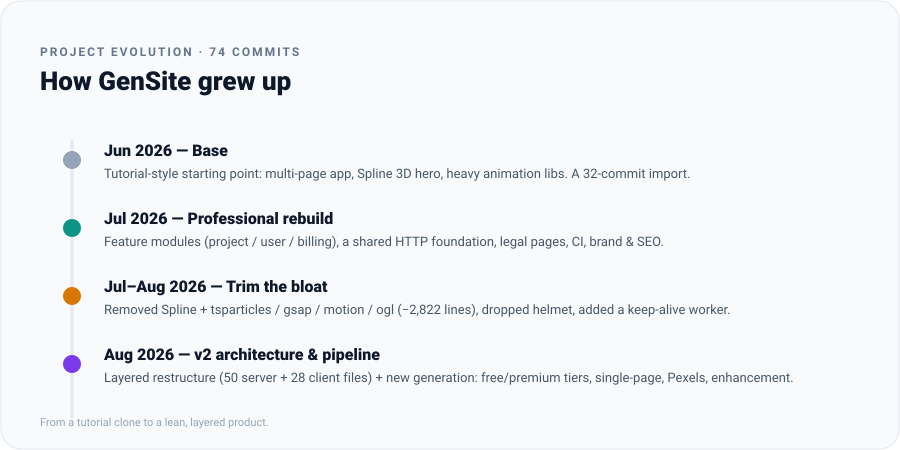
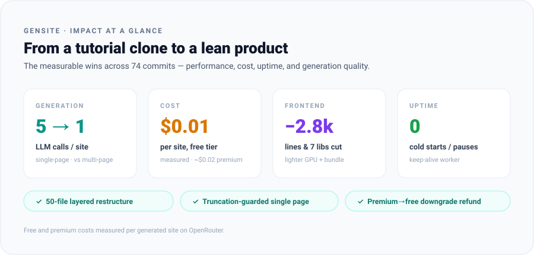
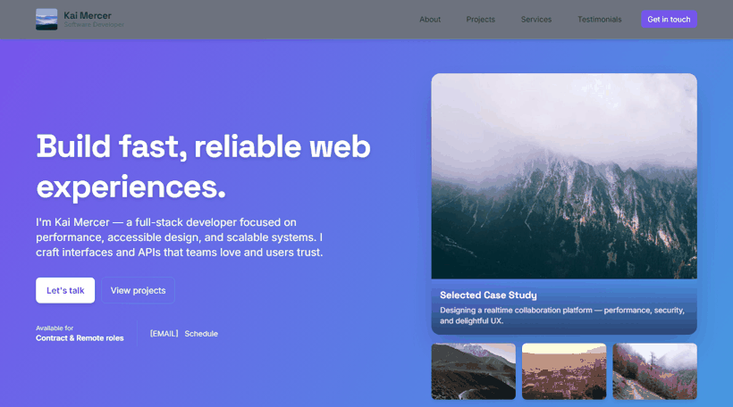
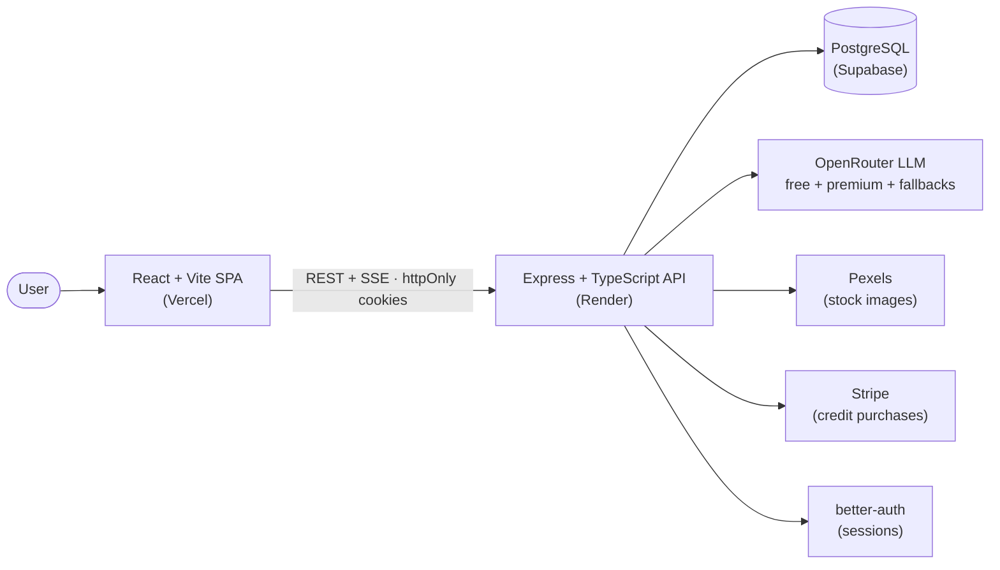
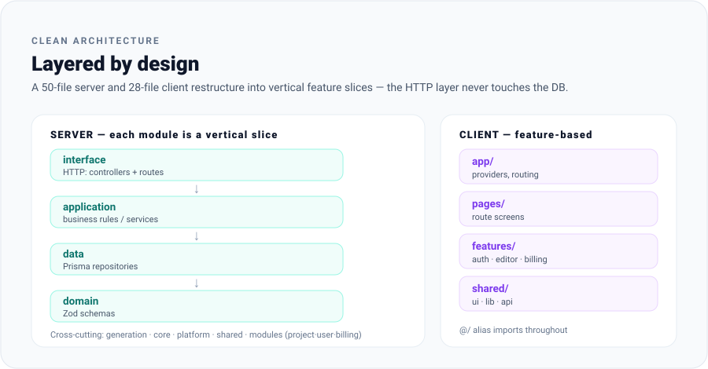
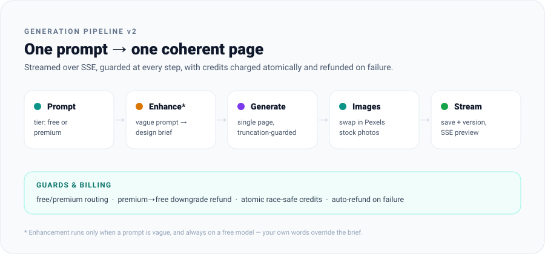
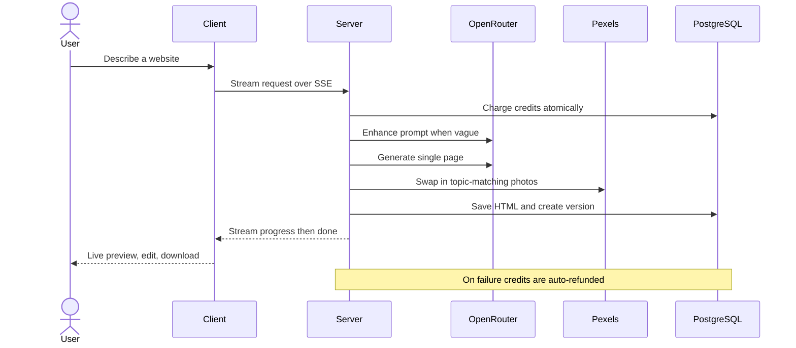
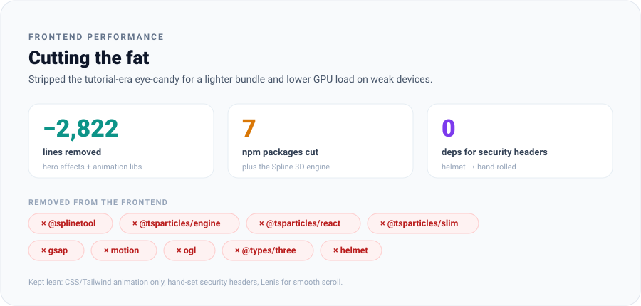

<div align="center">

# 🌐 GenSite — AI Website Builder

**Turn a single sentence into a complete, responsive website — in seconds, with AI.**

[](https://react.dev)
[](https://www.typescriptlang.org)
[](https://expressjs.com)
[](https://www.prisma.io)
[](https://supabase.com)
[](https://tailwindcss.com)

[**Live Demo →**](https://ai-website-builder-prathamesh-three-amber.vercel.app)

</div>

---

## ✨ What is it?

**GenSite** is a full-stack **generative-AI** web app that lets anyone build a website by *describing it in plain English*. Type something like *"a sleek landing page for a coffee brand with a menu and a contact section,"* and GenSite designs, generates, and publishes a complete, responsive **single-page** site — no code, no design tools, no templates.

It's a real product, not a demo: authentication, credit-based billing, live streaming previews, version history, an in-browser element editor, and one-click publishing to a public community gallery.

**The problem it solves.** Getting a website online still has a painfully high barrier to entry — non-technical people can't write HTML/CSS, agencies are slow and expensive, and drag-and-drop builders still demand hours of manual layout. GenSite collapses *"I have an idea"* → *"my site is live"* into a single sentence and a few seconds by putting an LLM in the generation loop.

## 🧭 The story so far

GenSite didn't start here. It began as a tutorial-style clone and was rebuilt, over **74 commits**, into a lean and layered product. The interesting part of this repo is that evolution:

<div align="center">
  
</div>

1. **Base (Jun 2026).** A tutorial-style starting point — a multi-page app with a Spline 3D hero and a stack of heavy animation libraries, imported across 32 commits.
2. **Professional rebuild (Jul 2026).** Restructured into feature modules (`project` / `user` / `billing`) on a shared HTTP foundation, with legal pages, CI, and brand + SEO assets.
3. **Trim the bloat (Jul–Aug 2026).** Removed the Spline hero and `tsparticles` / `gsap` / `motion` / `ogl` (−2,822 lines), dropped `helmet` for hand-rolled headers, and added a keep-alive worker.
4. **v2 architecture & pipeline (Aug 2026).** A layered restructure (50 server + 28 client files) and a rewritten generation pipeline: free/premium tiers, single-page generation, Pexels images, and prompt enhancement.

## 📊 Impact & ROI

The rewrite paid off across four dimensions — generation cost, frontend weight, uptime, and code structure:

<div align="center">
  
</div>

| Metric | Before | After |
| --- | --- | --- |
| LLM calls / site | ~5 (multi-page: 1 plan + 4 pages) | 1 (+1 if a vague prompt is enhanced) |
| Cost / site — Free | — | **~$0.01** (`gpt-oss-120b`) |
| Cost / site — Premium | — | **~$0.02** (`gpt-5-mini`) |
| Frontend weight | Spline + 7 animation libs | **−2,822 lines**, 7 packages removed |
| Cold starts / DB pauses | frequent | **0** (keep-alive worker) |
| Code structure | flat controllers/pages | **50 + 28 file** layered restructure |

> Costs are measured per generated site on OpenRouter.

## 🎚️ Free vs Premium — see the difference

Same prompt (*"a software developer portfolio"*), two tiers. The **free** model ships a clean, professional site; **premium** returns a richer, editorial layout — an asymmetric hero with a case-study card, a profile panel, design-token theming, and dark-mode support. **Click either preview to open the live page.**

<div align="center">
  <a href="https://raw.githack.com/Prathamesh51-debug/GenSite/main/assets/samples/premium.html" title="Open the live premium page"></a>
  <br/><sub>⭐ <strong>Premium's hero is animated</strong> — a slow, shifting gradient a static screenshot can't show. The free tier's hero is a flat gradient. <a href="https://raw.githack.com/Prathamesh51-debug/GenSite/main/assets/samples/premium.html">Open the live page</a> to see it move.</sub>
</div>

<table>
<tr>
<td width="50%" align="center"><strong>🆓 Free</strong><br/><sub><code>gpt-oss-120b</code> · 5 credits · ~$0.01</sub></td>
<td width="50%" align="center"><strong>⭐ Premium</strong><br/><sub><code>gpt-5-mini</code> · 20 credits · ~$0.02</sub></td>
</tr>
<tr>
<td valign="top"><a href="https://raw.githack.com/Prathamesh51-debug/GenSite/main/assets/samples/free.html" title="Open the live free-tier page"></a></td>
<td valign="top"><a href="https://raw.githack.com/Prathamesh51-debug/GenSite/main/assets/samples/premium.html" title="Open the live premium-tier page"></a></td>
</tr>
</table>

<div align="center"><sub>▶ Open the live pages: <a href="https://raw.githack.com/Prathamesh51-debug/GenSite/main/assets/samples/free.html">free sample</a> · <a href="https://raw.githack.com/Prathamesh51-debug/GenSite/main/assets/samples/premium.html">premium sample</a></sub></div>

> Every free build is still a complete, responsive site — premium is for when you want the most polished, consistent result. And if a premium request is ever served by a free model, the surcharge is **auto-refunded**, so you only pay premium for premium output.

## 🚀 Features

- 🧠 **Prompt-to-website generation** — describe it, get a full standalone HTML + Tailwind page
- ✍️ **Automatic prompt enhancement** — vague prompts are expanded into a prescriptive design brief (brand, palette, fonts, sections) before generation, so even a one-liner produces a premium result. Your own words always take priority over the brief.
- 🎚️ **Free & Premium tiers** — a fast free model for most sites, or a premium model for the most polished, consistent results. If a premium request is served by a free model, the premium surcharge is **automatically refunded**.
- 🖼️ **Topic-matching images** — real, on-subject stock photography via **Pexels**, added in a post-generation pass (graceful fallback when no key is configured — generation never breaks).
- 🔗 **Hardened in-page navigation** — every nav link is a smooth-scroll anchor to a section that actually exists (no dead `#` links).
- 💬 **Conversational revisions** — refine the page with natural-language follow-ups
- 🖱️ **In-place element editing** — click any section in the preview and edit just that piece
- 🕑 **Version history** — every change is versioned; roll back anytime
- 👀 **Live streaming preview** — watch the site build over SSE, rendered in a sandboxed iframe
- 🌍 **Publish to community** — share your site on a public gallery with a shareable URL
- ⬇️ **Download** — export your generated site to open or host anywhere
- 🔐 **Authentication** — email/password auth with secure, cross-domain sessions
- 💳 **Credit system + Stripe billing** — atomic, race-safe metering with paid top-ups

## 🏗️ Architecture


```mermaid
flowchart LR
    U([User]) --> FE["React + Vite SPA<br/>(Vercel)"]
    FE -->|"REST + SSE · httpOnly cookies"| API["Express + TypeScript API<br/>(Render)"]
    API --> DB[("PostgreSQL<br/>(Supabase)")]
    API --> AI["OpenRouter LLM<br/>free + premium + fallbacks"]
    API --> IMG["Pexels<br/>(stock images)"]
    API --> PAY["Stripe<br/>(credit purchases)"]
    API --> AUTH["better-auth<br/>(sessions)"]
```

The codebase is organized into **feature modules** with clear separation of concerns — a 50-file server and 28-file client restructure into vertical slices where the HTTP layer never touches the database:

<div align="center">
  
</div>

**Server** — each domain is a vertical slice; interface (HTTP) is thin and never touches the database:

```
interface (HTTP) → application (business rules) → data (Prisma) → domain (Zod schema)
```

```
server/src/
├── app.ts · server.ts          # app assembly (headers/CORS/CSRF/routers/errors) + bootstrap
├── generation/                 # the AI pipeline
│   ├── orchestrator/           #   generateSite · generateSinglePage · enhancePrompt
│   ├── prompts/                #   single-page + enhancement prompts · DESIGN_GUIDE
│   ├── providers/              #   model lists · fallback chain · tiers/costs
│   └── images/                 #   Pexels image provider + post-process
├── modules/
│   ├── project/                # crud · generation (SSE) · revisions · element edits
│   ├── user/                   # credits, projects, publish, catalogs
│   └── billing/                # Stripe checkout + webhook
├── core/                       # pure logic: credits, html, origins, plans (unit-tested)
├── platform/                   # auth · db · email · observability · storage
└── shared/                     # config (constants) · http (AppError/errorHandler) · middleware
```

Each `modules/*` slice is split into `interface/` (controllers + routes), `application/` (services), `data/` (repositories), and `domain/` (schemas).

**Client** — feature-based, `@/…` alias imports:

```
client/src/
├── app/                        # App, providers, routing
├── pages/                      # route screens — marketing · app · legal
├── features/                   # auth · editor · billing
└── shared/                     # ui · components · lib · api
```

## ⚙️ Generation pipeline

Generation was rewritten from a multi-page flow into a single coherent page, streamed over SSE and guarded at every step:

<div align="center">
  
</div>


```mermaid
sequenceDiagram
    actor User
    participant FE as Client
    participant API as Server
    participant AI as OpenRouter
    participant IMG as Pexels
    participant DB as PostgreSQL
    User->>FE: Describe a website
    FE->>API: Stream request over SSE
    API->>DB: Charge credits atomically
    API->>AI: Enhance prompt when vague
    API->>AI: Generate single page
    API->>IMG: Swap in topic-matching photos
    API->>DB: Save HTML and create version
    API-->>FE: Stream progress then done
    FE-->>User: Live preview, edit, download
    Note over API,DB: On failure credits are auto-refunded
```

## ⚡ Frontend performance

The tutorial-era eye-candy was stripped for a lighter bundle and lower GPU load on weak devices:

<div align="center">
  
</div>

- Removed the **Spline 3D hero** (−367 lines) and the interactive-hero animation stack — `@tsparticles/*`, `gsap`, `motion`, `ogl`, `@types/three` (−2,822 lines).
- Dropped **`helmet`** in favour of hand-set security headers.
- **Kept lean:** CSS/Tailwind animation only, Lenis for smooth scroll, and a keep-alive GitHub Action that warms Render and holds Supabase active — no more cold starts or DB auto-pauses.

## 🧰 Tech stack

| Layer | Technology |
| --- | --- |
| **Frontend** | React 19, Vite 7, TypeScript, Tailwind CSS 4, shadcn/ui, React Router 7, Axios, Sonner, Framer Motion, Lenis (smooth scroll), lucide-react |
| **Backend** | Node.js (≥ 20), Express 5, TypeScript, Zod 4 |
| **Database** | PostgreSQL (Supabase) + Prisma 7 (`@prisma/adapter-pg`) |
| **Auth** | better-auth (email/password, httpOnly cookie sessions) |
| **AI** | OpenRouter (OpenAI-compatible SDK) — free tier (`gpt-oss-120b` + `qwen3-coder` fallback) · premium tier (`gpt-5-mini`) |
| **Images** | Pexels API (topic-matching stock photos) |
| **Payments** | Stripe (Checkout + signed webhooks) |
| **Observability** | Langfuse (LLM traces) · Sentry (errors) — both optional, env-gated |
| **Testing / CI** | Vitest · GitHub Actions (typecheck · build · test) |
| **Hosting** | Vercel (client) · Render (API) · Supabase (DB) |

## 🛠️ Engineering highlights & design decisions

The interesting parts are the trade-offs, not the happy path:

- **Prompt enhancement for vague requests.** Short prompts (< 12 words) are expanded by a cheap free model into a maximally prescriptive single-page brief (invented brand, exact hex palette, exact Google Fonts, per-section content/layout/CTA) so even a weak model renders a premium result. The enhancer re-throws user cancels, falls back to the raw prompt on any error, and the generator is told the user's own words override the brief. (`server/src/generation/orchestrator/generate.ts`)
- **Truncation-guarded single-page generation.** Generation runs under a token cap and retries once on `finish_reason === 'length'`, keeping the fullest valid attempt — so large sites never ship half-written. Nav links are constrained to real in-page `#section` anchors with smooth scroll.
- **Two-tier model routing with a downgrade refund.** `createChatCompletion` tries the premium model, then falls through an ordered list of free models. If a *premium* build ends up served by a free model, the premium surcharge is detected (via the response model) and **refunded**. The active models live in one place and are overridable by env.
- **Atomic, race-safe credit metering.** Credits are charged with a single conditional `UPDATE ... WHERE credits >= amount`, so concurrent requests can't overspend. The **authoritative charge happens at generation time** (not project creation), and refunds only ever reverse a charge that actually happened — a failed build is refunded and never silently re-run for free.
- **Resilient AI layer.** Free LLM endpoints are rate-limited and frequently deprecated, so every call **retries transient `429`s and falls back across the model list on any provider error**.
- **Streaming generation over SSE.** The client reads the build off `fetch` (not `EventSource`), with an in-flight guard + cancel via a per-process `AbortController` map, and a per-project edit lock so two writers can't race the "current version."
- **Untrusted AI HTML is sandboxed.** Public/community/preview views render generated HTML in a `sandbox="allow-scripts"` iframe (no `allow-same-origin`) so AI output can't touch the host app or its cookies.
- **Idempotent Stripe billing.** Credits are granted from the **signature-verified webhook**, keyed by the unique `stripeSessionId`; refunds/disputes claw credits back exactly once, all inside DB transactions.
- **Security by default.** Hand-set security headers (`nosniff`, `X-Frame-Options: DENY`, `Referrer-Policy`, HSTS in prod), a CORS + Origin-based CSRF check driven by a trusted-origins allowlist, tiered rate limiters, a bounded JSON body, and a `/healthz` probe that also reports DB reachability.
- **Connection pooling.** Runtime traffic uses Supabase's **transaction pooler (PgBouncer)** via `DATABASE_URL`; Prisma migrations use a **direct connection** (`DIRECT_URL`) — avoiding connection exhaustion.

## ⚡ Getting started

### Prerequisites
- **Node.js ≥ 20**
- A PostgreSQL database (e.g. a free [Supabase](https://supabase.com) project)
- An [OpenRouter](https://openrouter.ai) API key
- A [Pexels](https://www.pexels.com/api/) API key — optional, for stock images
- A [Stripe](https://stripe.com) account (test mode) — optional, for billing

### 1. Clone
```bash
git clone https://github.com/Prathamesh51-debug/GenSite.git
cd GenSite
```

### 2. Backend
```bash
cd server
npm install
cp .env.example .env            # then fill in the values (see below)
npx prisma migrate deploy       # apply schema to your DB (direct connection)
npm run dev                     # API on http://localhost:3000
```

### 3. Frontend
```bash
cd client
npm install
cp .env.example .env            # set VITE_BASEURL
npm run dev                     # app on http://localhost:5173
```

## 🔑 Environment variables

**`server/.env`** (see `server/.env.example`)

| Variable | Description |
| --- | --- |
| `DATABASE_URL` | PostgreSQL connection — Supabase **transaction pooler** (port 6543, `?pgbouncer=true`) |
| `DIRECT_URL` | Direct DB connection — used **only** by Prisma migrations |
| `BETTER_AUTH_SECRET` | Random secret for signing sessions |
| `BETTER_AUTH_URL` | The API's public base URL |
| `TRUSTED_ORIGINS` | Comma-separated allowed origins (your frontend URL) — drives CORS **and** the CSRF check |
| `AI_API_KEY` | OpenRouter API key |
| `GEN_MODELS` / `GEN_MODEL` / `PREMIUM_MODEL` / `EDIT_MODEL` / `ENHANCE_MODEL` | _(optional)_ override the free model list / defaults / premium / edit / enhancer models |
| `PEXELS_API_KEY` | _(optional)_ enable topic-matching stock images; unset ⇒ generation keeps its fallback image URLs |
| `STRIPE_SECRET_KEY` · `STRIPE_WEBHOOK_SECRET` | Stripe keys (billing) |
| `RESEND_API_KEY` · `EMAIL_FROM` | _(optional)_ enable verification emails; unset ⇒ links logged to console |
| `LANGFUSE_SECRET_KEY` · `LANGFUSE_PUBLIC_KEY` · `LANGFUSE_BASEURL` | _(optional)_ LLM tracing |
| `SENTRY_DSN` | _(optional)_ error monitoring |
| `NODE_ENV` / `PORT` | environment / listen port (injected by most hosts) |

**`client/.env`** (see `client/.env.example`)

| Variable | Description |
| --- | --- |
| `VITE_BASEURL` | Backend API base URL (e.g. `http://localhost:3000`) — baked in at **build time** |

## 💳 Credits & tiers

New accounts start with **25 credits**. Costs are centralized in `server/src/shared/config/constants.ts`:

| Action | Cost |
| --- | --- |
| Generate (free tier) | 5 credits |
| Generate (premium tier) | 20 credits (`PREMIUM_MULTIPLIER = 4`) |
| Conversational revision | 5 credits |
| Element edit | 2 credits |

Failed builds are refunded automatically, and a premium build that falls back to a free model refunds the premium surcharge.

## 🧪 Scripts & testing

```bash
# server
npm run dev        # tsx watch
npm run build      # prisma generate && tsc && tsc-alias
npm start          # node dist/server.js
npm test           # Vitest (pure-function tests under src/core/__tests__)
npx tsc --noEmit   # typecheck

# client
npm run dev        # Vite dev server
npm run build      # production build
npm run lint       # ESLint
npx tsc --noEmit -p tsconfig.app.json
```

CI (`.github/workflows/ci.yml`) runs typecheck + build for both apps and the server test suite on every push/PR.

## 🚢 Deployment

| Piece | Platform | Notes |
| --- | --- | --- |
| **Client** | Vercel | Root = `client`. Set `VITE_BASEURL` to the API URL. `vercel.json` handles SPA routing. |
| **API** | Render | Build: `npm run build`. Start: `npm start` (`node dist/server.js`). Set `TRUSTED_ORIGINS` to the client URL. |
| **Database** | Supabase | Transaction pooler for `DATABASE_URL`; run `prisma migrate deploy` against `DIRECT_URL`. |

> ⚠️ **Migrations do not run at app startup.** Render's Supabase pooler can't run Prisma's schema engine, so apply schema changes via the Supabase SQL editor or a local direct-connection `prisma migrate deploy` — never in the start command.

Subscribe the Stripe webhook to `checkout.session.completed`, `payment_intent.succeeded`, `charge.refunded`, and `charge.dispute.funds_withdrawn`.

> 💡 A keep-alive GitHub Action pings `/healthz` on a schedule to warm the free Render tier and keep Supabase from auto-pausing.

## 🔒 Privacy & Terms

The app ships with in-product legal pages, served by the SPA:

- **Privacy Policy** → `/privacy`
- **Terms of Service** → `/terms`

These describe what data is stored (account, projects, billing records via Stripe) and the acceptable-use terms for generated sites. Update the copy under `client/src/pages/legal/` to match your deployment before going live.

## 👤 Author

**Prathamesh** · [GitHub](https://github.com/Prathamesh51-debug)

## 📄 License

Released under the MIT License.
